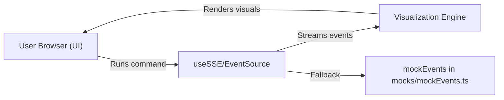
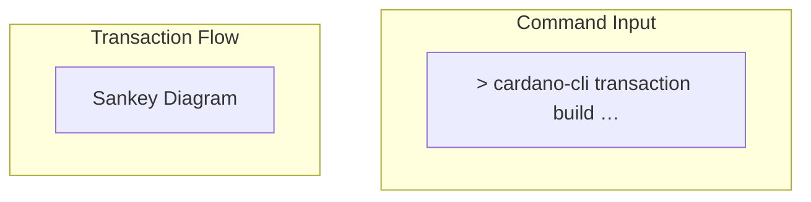
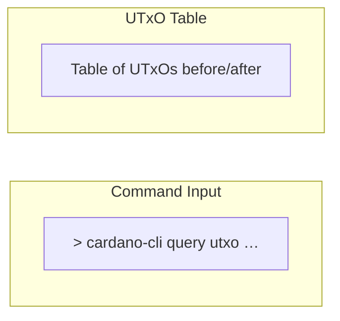

# Cardano-CLI Transaction Visualizer

A front-end-only React/Next.js application that streams Cardano-CLI commands as JSON events and renders a live transaction flow visualization.

## Requirements

* Browser capable of SSE/WebSocket (modern Chrome/Firefox/Edge)
* React/Next.js app (TypeScript preferred)
* `event-source-polyfill` for older browser support
* No backend required (optional mock events)

## Installation

```bash
npx create-next-app cardano-viz --typescript
cd cardano-viz
npm install react-flow-renderer xterm mustache event-source-polyfill
```

## File Structure

```plaintext
src/
├─ App.tsx                    # Root component: ties CommandInput + Visualization
├─ components/
│  ├─ CommandInput.tsx        # Textarea + Run & Visualize button
│  ├─ Visualization.tsx       # React Flow / D3 Sankey renderer
│  └─ useSSE.ts               # SSE hookup or mock event generator
└─ mocks/
   └─ mockEvents.ts           # Fake CliEvent generator
```

## Architecture



mermaid
flowchart LR
A\[User Browser (UI)] -->|Runs command| B\[useSSE / EventSource]
B -->|Streams JSON events| C\[Visualization Engine]
C -->|Renders visuals| A
B -->|Fallback to mock| D\[mockEvents (mocks/mockEvents.ts)]

````

## Covered CLI Commands

### Key & Address Generation

```bash
cardano-cli address key-gen --verification-key-file payment.vkey --signing-key-file payment.skey
cardano-cli address build --payment-verification-key-file payment.vkey --out-file payment.addr --testnet-magic 1097911063
````

### UTxO Query

```bash
cardano-cli query utxo --address $(cat payment.addr) --testnet-magic 1097911063
```

### Build/Sign/Submit (Simple Transaction)

```bash
cardano-cli transaction build-raw --tx-in TXIN#0 --tx-out RECIPIENT_ADDR+1000000 --fee 170000 --out-file tx.raw
cardano-cli transaction sign --signing-key-file payment.skey --tx-body-file tx.raw --out-file tx.signed --testnet-magic 1097911063
cardano-cli transaction submit --tx-file tx.signed --testnet-magic 1097911063
```

### Scripted Transaction (AlwaysSucceed)

```bash
cardano-cli transaction build --alonzo-era --tx-in-script-file alwaysSucceed.plutus --tx-in-script-redeemer-file redeemer.json --tx-in TXIN#0 --tx-out $(cat payment.addr)+1000000 --change-address $(cat payment.addr) --testnet-magic 1097911063
```

## Layout Diagrams





## Demo Script Steps

1. **Generate Keys & Address**

   ```bash
   cardano-cli address key-gen …  
   cardano-cli address build …
   ```
2. **Query UTxO Before**

   ```bash
   cardano-cli query utxo --address $(cat payment.addr) …
   ```
3. **Build/Sign/Submit**

   ```bash
   cardano-cli transaction build-raw …  
   cardano-cli transaction sign …  
   cardano-cli transaction submit …
   ```
4. **Visual Confirmation**
   Sankey or pie chart shows input UTxO consumed and new UTxO created
5. **Scripted Lock Funds**

   ```bash
   cardano-cli transaction build … --tx-in-script-file alwaysSucceed.plutus …
   ```
6. **Unlock Funds**

   ```bash
   cardano-cli transaction build … --tx-in-script-redeemer-file redeemer.json …
   ```
7. **Query UTxO After & Balance Diff**

   ```bash
   cardano-cli query utxo --address $(cat payment.addr) …
   ```

   ```diff
   - Wallet: 5 ADA
   + Wallet: 4 ADA
   ```

*End of README.md*
